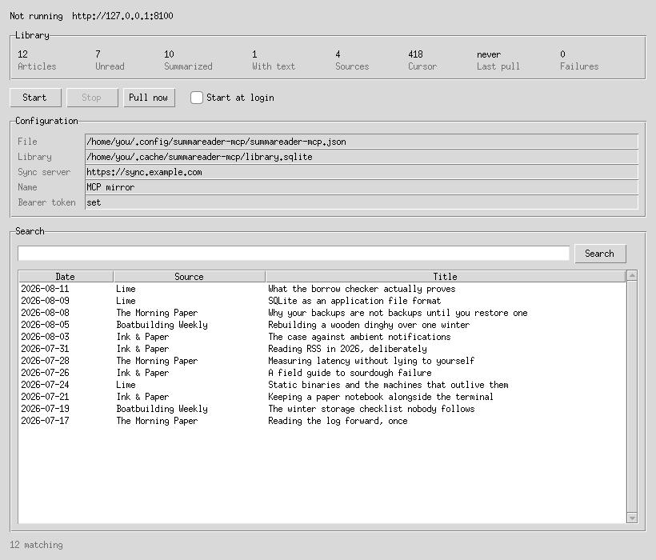

# summareader-mcp

An MCP server that pairs with a SummaReader sync server **as a device**, keeps a
decrypted copy of the library, and answers questions about it.

It reads; it does not write. Nothing it holds ever changes, which is what
makes it safe to point at a library you care about.

Four ways in — MCP, a command line, a terminal interface and a window — over
one set of functions, so they cannot answer the same question differently.

## Why it is a device and not part of the server

The sync server holds opaque ciphertext and no keys — that is the whole design,
and it is what "encrypted end-to-end, including on servers we run" means. So an
MCP server running *on* the sync server could serve almost nothing: it cannot
read a title, a summary, or anything else worth asking about.

This runs where the keys are instead. It pairs like any other device, gets the
master key the same way a second phone does, and decrypts what it reads. That
means it is **revocable like any other device**, which is the property that
makes it safe to run at all.

## What that costs

Its local copy is plaintext. Whoever can read that disk can read the whole
library.

So the copy is a **cache**, deliberately: rebuildable from the log, safe to
delete, never the only copy of anything. Delete it and the next run rebuilds
it. Two consequences worth stating rather than discovering:

- Run it on a machine whose disk you trust, and encrypt that disk.
- **Do not run it on the same host as your sync server.** That host would then
  hold plaintext, which quietly undoes the sentence at the top for your own
  deployment. This is a requirement rather than advice.
- It holds **more** than any of your devices do. Articles, summaries and — with
  `fetch_bodies` on, which is the default — the article text as well. It runs
  no retention, so nothing here is ever evicted: over time this becomes the
  most complete copy of your library that exists anywhere.

## A second implementation, checked against the first

This is Python; the app is Dart. Neither can import the other, so the protocol
is implemented twice — which is a second chance to get it wrong, and every way
of getting it wrong is silent. A mistaken HKDF label, gzip applied after the
encryption instead of before, the MAC left joined to the ciphertext: none of
them raise. Each produces a log that reads as empty, indistinguishable from a
library nobody has written to.

The previous version of this program is the proof. It read `title` at the top
level of a decrypted record, where the format nests it under `data`, and
mirrored a library of items with no titles, no sources and no summaries for
months. `search_library` scans exactly those fields, so every query ever asked
of it came back with nothing. It never errored.

So the format is written down where both readers can see it:

- **`summareader/docs/SYNC_PROTOCOL.md`** — the endpoints, the key hierarchy,
  the envelope, every record's shape, blob naming, and the ordering rules.
- **`summareader/docs/protocol-vectors.json`** — a fixed, public master key,
  the subkeys derived from it, one sealed record per operation, and blob names.
  Generated by that repo's `tool/protocol_vectors.dart`.

`tests/test_vectors.py` opens all of them. If it passes, this agrees with the
app about the envelope, the key derivation and the record format. If it fails,
it does not — and that is otherwise a silent failure rather than a loud one.

Point the tests at a checkout elsewhere with `SUMMAREADER_VECTORS=/path/to/protocol-vectors.json`.

## The tools

| Tool | Answers |
| --- | --- |
| `search_library` | Articles whose title, source, summary or text mention something |
| `recent_items` | The most recently published articles |
| `library_summary` | How much is here, how much is summarized, how far the log has been read |
| `read_item` | One article in full, including its text |
| `library_report` | A written report over a set of articles, as Markdown, CSV or JSON |

`search_library` narrows by `query` (title, source, summary and article text at
once), `title` or `source` alone, `unread`, `summarized`, and four times:
`since`/`until` for when an article was published, `read_since`/`read_until`
for when it was read. Each of those takes `3h`, `7d`, `3w` or a
date like `2026-08-01`. The command line takes the same set as flags.

A needle matches where a word starts, so `rust` finds "Rust" and "rustc" but
not "trust". It is a substring from there on: the whole query has to appear in
one column as typed, and there is no stemming.

Read times are what this mirror saw, not what the log said: a read record
carries `read`, `saved` and `position`, and no timestamp, so the arrival of one
is the closest thing to a read time that exists. A backfill is therefore left
unstamped rather than claiming a decade of reading happened the afternoon the
mirror was set up, which means `read_since` answers for what has been read
since this started running and nothing before it.

Read-only, deliberately. A tool that wrote to the log would be a second writer
of a format the app owns, and getting that wrong corrupts a library rather than
returning a bad answer.

## Reading a library that is already here

If this runs on the same machine as the app — the box that fetches and
summarizes while nobody is looking — it does not need sync, keys, or a second
plaintext copy of anything:

```sh
./scripts/run.sh --library ~/.local/share/sk.dataiza.summareader/summareader.sqlite ui
```

The file is opened **read-only**; the app can be running against it at the same
time. Every command and every MCP tool works the same way.

## Running it headless, and reading it from a terminal

The other direction: the library stays on the box that is allowed to hold it,
and a terminal anywhere else reads it over that box's HTTP transport. **One
host holds the plaintext, and every reader borrows it** rather than each one
keeping a copy that has to be trusted, encrypted and cleaned up.

**On the box.** Nothing listens until it is told to:

```sh
./scripts/run.sh serve --transport=http --host=0.0.0.0 --port=8100
```

Set `bearer_token` in the config before that address, not after. Anything
wider than loopback publishes the entire library, in plaintext, to whatever
can route to the port — `scripts/install.sh` refuses to install such a bind
while the key is unset, and the server warns about it at startup. (The key was
`http_token` until this week; configs written with that name are still read.)

```sh
openssl rand -base64 32
```

**Leaving it running.** `run.sh` is a foreground process that dies with the
shell that started it, which is right for trying it and wrong for a box you
then walk away from. [§4](#4-as-a-user-service) is the durable form:

```sh
HOST=0.0.0.0 PORT=8100 ./scripts/install.sh    # systemd user service
./scripts/install.sh --docker                  # or a container, restarting with the machine
```

**From the other machine.** The token is the only credential a reader carries:

```sh
export SUMMAREADER_MCP_TOKEN=…                          # the mirror's bearer_token
./scripts/run.sh --remote http://box:8100 status
./scripts/run.sh --remote http://box:8100 search "borrow checker" --since 30d
./scripts/run.sh --remote http://box:8100 recent --limit 10
./scripts/run.sh --remote http://box:8100 report --since 7d --out week.md
./scripts/run.sh --remote http://box:8100 ui
```

`--remote` needs no config file, no device token and no master key — it holds
no library, so it decrypts nothing. `/mcp` is added to the address if you leave
it off. This is also where a checkout stops being the convenient spelling: a
laptop that only ever reads wants the package installed (`pip install .` into a
virtualenv) or the frozen `dist/summareader-mcp`, and takes the same flags
either way.

`serve` and `pull` refuse under `--remote`, with a sentence rather than a
key-length error:

```
summareader-mcp: --remote reads a mirror; it cannot be one. Drop --remote, or
run this against the machine that holds the library.
```

Both need the master key, and a reader over a port has none by design. Reading
only is the shape of the thing rather than a gap: `--remote` speaks the MCP
tools, and the tools read.

Which machine holds what, since that is the entire point of the arrangement:

| | Holds |
| --- | --- |
| The box running `serve` | the master key, the device token, and the decrypted library in plaintext |
| The terminal reading it | nothing — an address and a bearer token, both of which are revocable |

The terminal interface is a client like any other under `--remote`: a separate
process, talking to a server that is a separate process, over the same tools a
model would use. It holds one MCP session open for as long as it runs rather
than dialling per search — on a thread of its own, because Textual is already
running an event loop and a second one cannot nest inside it.

Not to be confused with `server` in the config file, which is the sync server
this mirrors *from*. `--remote` is a mirror it reads.

## Running it

Seven ways to start it, and what separates them is who is on the other end: a
model, a person at a terminal, a person at a window, a shell, or nobody at all
until a client connects. They are the same program over the same functions — the choice is
about where it lives, not about what it can answer.

Configuration is three values, whichever way: the sync server, a device token,
and the master key. Put them in a file rather than the environment — `docker
inspect` prints an environment, and a file can be mounted read-only.

```sh
cp summareader-mcp.example.json summareader-mcp.local.json   # then fill it in
```

The device token comes from a paired device (`POST /enroll`) or from
`summareader-sync first-device` for the first one, and is revocable. The master
key is the value the pairing QR carries — **it is not revocable, and anything
holding it can read everything.**

**The short way to all three:** in the app, Settings → Sync → *Another device*,
name it, *Make a code*, then **Copy MCP config**. That writes exactly this
file's `server`, `token`, `master_key` and `name`, filled in. A pairing code is
a QR with one-letter keys — `k` is the master key, `t` the new device's token —
and matching those against these names by eye is a mistake nobody notices until
the mirror refuses to start.

None of this is needed to read a library that is already on the machine; see
[above](#reading-a-library-that-is-already-here), which needs no server, no
token and no key.

### How the command is spelled

The same program answers to three names, and which one you have depends on how
it arrived on the machine. A fresh checkout has none of them on `PATH`:

| Spelling | Where it comes from |
| --- | --- |
| `./scripts/run.sh …` | a checkout, and nothing else — it runs `.venv/bin/summareader-mcp` and points the config and the cache at the copies beside the repository |
| `summareader-mcp …` | installing the package. `./scripts/install.sh` builds its own virtualenv and symlinks the console script into `~/.local/bin`; `pip install .` into any virtualenv puts it on that environment's path |
| `./dist/summareader-mcp …` | `./scripts/freeze.sh` — one file with no Python outside it, run by its path and never installed anywhere |

Every example here is written as `./scripts/run.sh`, because that is the one
spelling a reader of this file certainly has. The arguments after it are
identical whichever name you type.

Which way to run it, in one table — the columns are who is on the other end,
and whether Python of the right version is on the machine:

| You want | Native | Docker |
|---|---|---|
| A model, over stdio | `./scripts/run.sh` | — a container is not a subprocess |
| A model, over a port | `./scripts/run.sh serve --transport=http` | `docker compose up -d` |
| It back after a reboot | `./scripts/install.sh` | `./scripts/install.sh --docker` |
| To read it yourself | `./scripts/run.sh ui` | `./scripts/run.sh ui` — on the host, against the same `./.cache` the container mounts |
| To start and watch it from a window | `./scripts/run.sh gui` | — a container has no display; run the window on the host |
| To read a mirror on another box | `./scripts/run.sh --remote http://box:8100 …` | same — it is the port that answers |
| No Python on the machine | `./scripts/freeze.sh`, then `./dist/summareader-mcp` | any of the above |

The window ([§7](#7-in-a-window)) is for the machine that holds the library: it
starts and stops the server there and searches what it holds. Reading a mirror
that lives on some other machine is the terminal interface's job over
`--remote`, which needs no window and no display — so the two do not overlap
and neither is a smaller version of the other.

### 1. As an MCP server

```sh
./scripts/run.sh                                   # stdio, and no port at all
./scripts/run.sh serve --transport=http --port=8100
```

**Stdio** is the default because it is what a local client expects: configured
with a `command:`, it starts this process itself and talks down its standard
input. Nothing listens, nothing is published, and there is no token to get
wrong — the client and the server are the same process tree, so the operating
system has already answered the question a token would be asking.

**HTTP** is for a client that cannot start the process: one on another machine,
or one talking to a container or a service, neither of which is a subprocess of
anything. Port 8100 unless `--port` says otherwise.

The HTTP transport binds loopback unless `--host` says otherwise. That is the
right default nearly everywhere and the wrong one inside a container, where
loopback is reachable by nothing and the port is published by the runtime — so
the container passes `--host=0.0.0.0` and a desktop does not, because there the
same address is a firewall prompt nobody asked for.

Set `bearer_token` in the config and callers must present it as a bearer token.
(It was `http_token` before, and configs written with that name still work.)
Without one the port is open to anyone who can reach it, and the server says so
at startup — the encryption ends at this process, which is what it is for and
why it needs a boundary of its own. `/health` never needs the token: it reports
whether the process is up and nothing about what it holds, and a health check
that needs a secret breaks the day the secret rotates.

**Until now the token guarded `/metrics` and nothing else.** The MCP endpoint —
every tool, the whole library — answered anyone who could reach the port, while
this paragraph, the unit file and the installer all said the token was what made
that port safe. It now guards the whole app, `/health` excepted. If you have
been reaching your mirror over HTTP without sending a bearer token, that is the
thing that will stop working, and it should have been stopping all along.

### 2. The terminal interface

```sh
./scripts/run.sh ui
```


A query at the top, what matches under it, the article beside them, and `e` to
write the current result set to a Markdown file where you started it. `u` and
`s` narrow to unread and to summarized, `esc` goes back to the box, `q` leaves.

It has one box rather than a flag for each filter, so it reads fields out of
what is typed:

```
source: "Colion Noir" since:7d unread:yes
title:rust before:2026-08-01
```

`source`, `title`, `since`, `until`, `read_since`, `read_until`, `unread` and
`summarized`, with `feed`, `after`, `before` and `read` as aliases. Everything
else stays words to search for, so a title with a colon in it costs a search
rather than an error.

There is a window too, [§7](#7-in-a-window), and it is not this: the window
starts the server and searches, and stops at the list of results. Reading an
article is what this interface is for.

The picture above is the program rather than a drawing of it —
`scripts/screenshot.py` seeds a small library through the real store and paints
the real interface headlessly, and writes `docs/tui.svg`:

```sh
uv run python scripts/screenshot.py
```

An SVG rather than a PNG because it stays readable when GitHub scales it, and a
script rather than a screenshot taken by hand because one nobody can reproduce
goes stale without ever saying so.

### 3. On the command line

Everything the tools do, without a language model in the room — which is also
how you check what the tools are answering.

```sh
./scripts/run.sh search "borrow checker" --since 30d
./scripts/run.sh recent --limit 10
./scripts/run.sh report --source "Hacker News" --since 7d --out week.md
./scripts/run.sh status
./scripts/run.sh pull              # sync once and say what arrived
```

`search` takes the same filters as `search_library` as flags: `--title`,
`--source`, `--unread`, `--summarized`, `--since`/`--until` for when an article
was published and `--read-since`/`--read-until` for when it was read. `recent`
is the newest of them, `report` writes a set of articles down as Markdown, CSV
or JSON, and `status` says how much is here and how far the log has been read —
the first thing to run when a query comes back empty.

`--format json` on any of the reading commands, for something else to consume.

`./scripts/run.sh` is the checkout spelling, against the config and cache
beside the repository; after `./scripts/install.sh` the same commands are
`summareader-mcp search rust` and the service's own cache.

### 4. As a user service

```sh
./scripts/install.sh              # its own venv, installed as a systemd user service
./scripts/install.sh --docker     # or runs it as a container
./scripts/install.sh --uninstall  # either one, reversed
```

The service uses the HTTP transport, because a service has no client on the
other end of its standard input; a local MCP client that starts its own
subprocess wants `scripts/run.sh` and no service at all. It is a *user*
service, under `~/.config/systemd/user` — this process holds the master key and
a plaintext copy of the library, so it belongs to one person and needs no root
to install or remove. `scripts/summareader-mcp.service` is the definition the
installer fills in.

This is also what puts `summareader-mcp` on `PATH`: the installer builds a
virtualenv of its own under `~/.cache/summareader-mcp/venv`, `pip install .`
into it, and symlinks that environment's console script into `~/.local/bin`.
Its own virtualenv because a service should not have its dependencies changed
by something else on the machine, and the unit's `ExecStart` is that symlink
rather than anything in this checkout — so the service keeps running whatever
you do to `.venv` afterwards.

The port and the address are the installer's, not the unit file's — edit the
installed copy and the next install overwrites it:

```sh
PORT=8300 ./scripts/install.sh                     # somewhere else
HOST=0.0.0.0 PORT=8300 ./scripts/install.sh        # reachable from the LAN
```

**The unit passes `--host=127.0.0.1` unless `HOST` says otherwise, where it
used to bind every interface.** That is a deliberate break, and it is the kind
that arrives looking like a bug: if you reach your mirror from another machine
on your LAN, it will stop answering after the next install, and nothing will
say why — `HOST=0.0.0.0` is how you say you meant it. The old default was
bind-everything by accident rather than by choice, and a user service that
serves an entire library in plaintext to the network, with the token optional,
is not something anybody decided on purpose.

The installer refuses to start without a config, and **refuses a `HOST` wider
than loopback while `bearer_token` is unset** — that address serves the whole
library in plaintext to anything that can route to it. On loopback the same
missing token is a warning rather than a refusal. The Docker path installs no unit: `restart: unless-stopped` and
an enabled `docker.service` already restart the container after a reboot.

Running it as a service rather than a container changes what `server` in the
config has to be: `http://sync:8099` is a Docker service name and resolves only
on that network.

### 5. In a container

```sh
docker compose up -d
curl http://127.0.0.1:8100/health
```

HTTP rather than stdio, because a container is not a subprocess its client can
start. `scripts/run.sh --docker` is the same image in the foreground, for
trying it on a machine with no Python of the right version.

The image sets `SUMMAREADER_MCP_CONFIG=/config/summareader-mcp.json` and
`SUMMAREADER_MCP_CACHE=/cache` itself and passes `--host=0.0.0.0`, so the
mounted paths and the published port work as compose reads them — compose
passes neither, and the per-platform defaults are not container paths.

If the sync server is another container on the same host, put both on one
network and use its service name; `host.docker.internal` will not reach a sync
server that is bound to localhost, which its own compose does on purpose. The
compose file has the block to uncomment.

### 6. As one executable

```sh
./scripts/freeze.sh          # dist/summareader-mcp, about 30 MB
```

PyInstaller, driven by `summareader-mcp.spec`. One file that needs no Python on
the machine it runs on, which is what a desktop build has to be able to hand
over, and which serves, searches, paints the terminal interface and opens
the window like any other way of starting it — `tkinter` is no longer excluded
from the bundle and `summareader_mcp.gui` is named as a hidden import, because
what PyInstaller cannot see it does not pack. The script builds it and then runs it — `--help`, a
library created from `schema.sql`, and that same file read back through
`--library` — because the interesting failure is not at start-up: `schema.sql`
is a data file, and a bundle that lost it starts perfectly and fails when
somebody opens a library.

Built on the machine it is built for, one platform at a time. **Only the Linux
executable has been produced so far**; the macOS and Windows builds have to run
on macOS and Windows, and until somebody does that they are untested rather
than merely unbuilt.

### 7. In a window

```sh
./scripts/run.sh gui                    # --host and --port, as serve takes them
```



For the machine that holds the library, and for the two jobs that were
terminal-only with no good reason: keeping the server running, and asking what
is in there. Tkinter, from the standard library — a window with six controls on
it does not earn a toolkit that would put another hundred and fifty megabytes
inside the frozen executable, and the import is lazy, so an interpreter built
without Tk still runs everything else.

What it shows, and what each control does:

| | |
|---|---|
| **status line** | whether the server is answering, on which address, and whether systemd is the one running it |
| **Library** | articles, unread, summarized, with text, sources and the cursor — read from the library file the search box has open anyway — then last pull and failures, which are not in the file because they live in the running process's memory, and are scraped from its `/metrics` with the configured `bearer_token`. `/health` is what "running" means |
| **Start / Stop** | the server. With a user unit installed these drive `systemctl --user`; without one, Start runs a child process |
| **Pull now** | one sync now rather than at the server's next timer — the same `Puller` the command line's `pull` runs, in this process, since WAL makes a second reader of the same file a non-event and every record applies by id |
| **Start at login** | writes `~/.config/systemd/user/summareader-mcp.service` and enables it; unticking removes it again. It re-reads from disk afterwards, so it cannot sit ticked beside a service that failed to install. Linux only — the row is absent elsewhere |
| **Configuration** | the config file's path and what is in it, including whether a bearer token is set. Read-only text: a window that writes somebody's master key back out is a window that can lose it |
| **Search** | the same `Store` the command line's `search` uses, and `RemoteStore` under `--remote` — one code path, so it cannot answer differently. Date, source and title; there is no article pane, because that is [§2](#2-the-terminal-interface) |

**The server is a child process, not something embedded in the window.**
`serve` blocks, holds the master key, and is the thing being restarted — inside
the window an unhandled traceback in the sync loop would take the window down
with it, and the desktop path and the service path would be two pieces of code
free to drift apart. So the window starts exactly the argv the unit's
`ExecStart` line holds: `serve_argv()` is the one spelling of "run the server",
the unit is rendered from it, and a test asserts the two are the same string.

**One owner at a time.** With a unit installed, systemd owns the server and the
window is a remote control for it — Start and Stop drive `systemctl --user`,
and the window never starts a child of its own. Two servers on one library both
pull and both advance the same cursor, and the second one simply fails to bind
the port, which from a window reads as "Start did nothing".

"Start at login" writes and removes the unit itself rather than calling
`scripts/install.sh`. That script wants a repository, builds a virtualenv and
runs `pip install .`; a frozen executable on somebody's desktop has none of
those and still deserves a server that comes back after a reboot.

Under `--remote` or `--library` the window says so in a sentence at the top and
greys out Start, Stop and Pull — a reader over a port has no master key, and a
library file the app owns is not this program's to sync. Search and the counts
work in both, which is the half that is actually a reading job. It is the same
refusal `cli.py` gives when `serve` is asked for over `--remote`, in the place
a window can put it.

The picture is the real window rather than a drawing of it:

```sh
DISPLAY=:0 uv run python scripts/gui_screenshot.py
```

Unlike the terminal interface, which Textual can paint headlessly, Tk has no
software renderer — so this one is a photograph and needs a display, and the
script says that and stops rather than writing nothing. It seeds the same demo
library `scripts/screenshot.py` uses and points `XDG_CONFIG_HOME` at a
temporary directory, so "Start at login" reads false whatever the machine
taking the picture has installed, and taking it can never write a unit into
somebody's real config.

### Where it keeps things

With nothing said, the config file and the cache go where the platform puts
them: `~/.config/summareader-mcp/` and `~/.cache/summareader-mcp/` on Linux
(`XDG_CONFIG_HOME` and `XDG_CACHE_HOME` are honoured), `~/Library/Application
Support/summareader-mcp/` and `~/Library/Caches/summareader-mcp/` on macOS, and
`%APPDATA%`/`%LOCALAPPDATA%` on Windows.

`SUMMAREADER_MCP_CONFIG` and `SUMMAREADER_MCP_CACHE` override both and always
win — which is how the container keeps `/config` and `/cache`, how the service
unit points at one person's own directories, and how `scripts/run.sh` points at
the copy beside this repository.

### Starting fresh

The cache is one file, `library.sqlite`, in the cache directory above. Nothing
else has to be undone: delete it and the next run replays the log from zero.

```sh
systemctl --user stop summareader-mcp    # or: docker compose down
rm ~/.cache/summareader-mcp/library.sqlite*
./scripts/run.sh pull                    # rebuilds, then says what arrived
```

The `*` matters — WAL leaves `-wal` and `-shm` beside the database, and a
stale pair against a new file is a corrupt read rather than a clean start.
Stopping first is for the same reason: a running server holds the file open.

The config file is *not* in the cache directory and is not touched by this,
so the server, the token and the keys survive. Deleting the database also
deletes the sync cursor it keeps, which is exactly what makes the next `pull`
a full one rather than an incremental one.

In a container the same file is `./.cache/library.sqlite` beside the compose
file, deleted from the host.

Under `--library` this does not apply and must not be done: that file is the
app's own library, not a cache, and this program only ever reads it.

## Testing it

```sh
uv venv && uv pip install -e ".[dev]"
pytest
```

A hundred and thirty-nine tests: the protocol against the app's own vectors, the summary
repair ladder against a corpus of real model failures, the store, the puller
against a fake sync server, the command line, and the terminal interface driven
headlessly.

What is *not* covered by them: a real sync server with real encrypted entries.
The puller is tested against a fake that seals its entries with the same code
this opens them with, so the two agree by construction — the vectors are what
stop that being circular, because they were produced by the Dart implementation
instead.

The decrypted mirror is kept in the cache directory between runs, so a restart asks for
what has arrived since rather than re-reading and re-decrypting the whole log.
It is still only a cache: deleting the volume costs one re-read and no data,
and anything unreadable in it — corrupt, half-written, or from a newer format
— is treated as empty rather than as an error.

## Metrics

`GET /metrics` on the HTTP transport, in the Prometheus text format, behind the
same bearer token as the tools. Not behind a second one: a scraper that can
reach this port can already ask it for the articles themselves, so another
credential would be ceremony rather than security.

It reports the mirror rather than the library — items held, how many carry a
summary, how far through the log the cursor is, how long since the last read
and how many reads failed. Those are the numbers that answer *is the mirror
keeping up*, which is the only operational question this process has: "up to
date" and "stopped reading" look identical from an item count alone.

`/health` still needs no token. It says whether the process is up and nothing
about what it holds, and a health check that needs a secret stops working the
day the secret rotates.

Nothing in the output names an article. This is the one process that holds the
library in plaintext, and a label carrying a title would put it somewhere
nobody expects to find one — a test asserts it.
