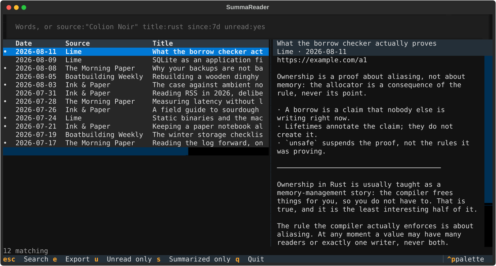
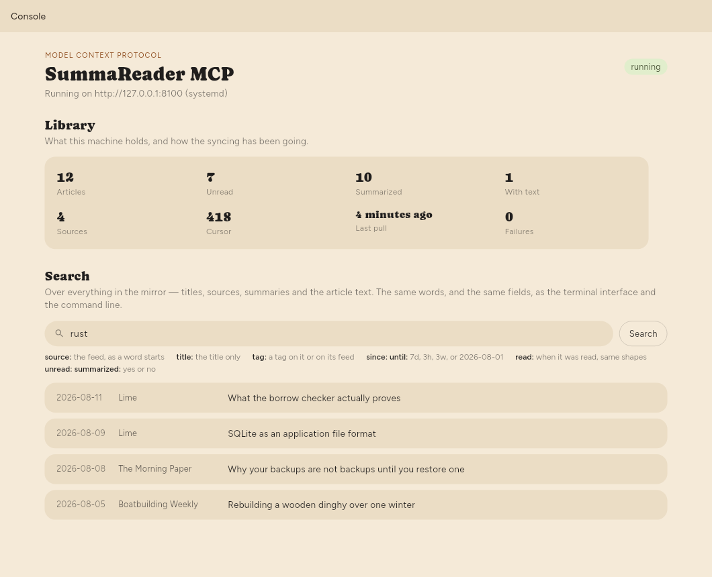

# summareader-mcp

An MCP server over your SummaReader library. It pairs with the sync server **as
a device**, keeps a decrypted copy, and answers questions about what you have
read. It reads; it never writes.

Five ways in — MCP over stdio, MCP over HTTP, a command line, a terminal
interface and a desktop console — all over the same functions.

**It holds the master key and a plaintext copy of your library.** The
encryption ends at this process, which is what it is for. Run it on a disk you
trust, and **not** on the same host as your sync server.

| Tool | Answers |
| --- | --- |
| `search_library` | Articles whose title, source, summary or text mention something |
| `recent_items` | The most recently published articles |
| `library_summary` | How much is here, how much is summarized, how far the log has been read |
| `read_item` | One article in full, including its text |
| `library_report` | A report over a set of articles, as Markdown, CSV or JSON |

Why it is built this way: [docs/design.md](docs/design.md).

## Install

### Downloads

Built releases are on this repository's [Releases](../../releases/latest) page.

| | For | File |
|---|---|---|
| **Headless** | a server an MCP client reaches over HTTP | `summareader-mcp-headless-<os>-<arch>.tar.gz` |
| **Console, Linux** | a desktop, with a window | `summareader-mcp-console-linux-x64.tar.gz` |
| **Console, macOS** | a Mac, with a window | `summareader-mcp-console-macos.zip` |

### Config first (every variant needs it)

```sh
cp summareader-mcp.example.json summareader-mcp.local.json
$EDITOR summareader-mcp.local.json
```

Three values are required: `server`, `token`, `master_key`. In the app,
Settings → Sync → Add another device → **Copy MCP config** writes all three
plus `name`.

| Key | Environment | What it is |
| --- | --- | --- |
| `server` | `SUMMAREADER_SYNC_URL` | the sync server this mirrors *from* |
| `token` | `SUMMAREADER_DEVICE_TOKEN` | this device's token, revocable |
| `master_key` | `SUMMAREADER_MASTER_KEY` | the library key, base64, **not** revocable |
| `name` | `SUMMAREADER_MCP_NAME` | what the app's paired-devices list calls this |
| `bearer_token` | `SUMMAREADER_MCP_TOKEN` | the credential the HTTP port demands (`http_token` is the old spelling, still read) |
| `host` | `SUMMAREADER_MCP_HOST` | what `serve --transport=http` binds. `127.0.0.1` by default |
| `port` | `SUMMAREADER_MCP_PORT` | the port it binds. `8100` by default |
| `poll_seconds` | `SUMMAREADER_MCP_POLL` | how often it pulls. `300` by default |
| `fetch_bodies` | `SUMMAREADER_MCP_BODIES` | download article text as well as summaries. `true` by default |
| `library` | `SUMMAREADER_MCP_LIBRARY` | read a library file that is already here, read-only, and do not sync. With it set, nothing above is required |
| `cache_dir` | `SUMMAREADER_MCP_CACHE` | where `library.sqlite` lives |
| — | `SUMMAREADER_MCP_CONFIG` | which file the above is read from |

Defaults: `~/.config/summareader-mcp/` and `~/.cache/summareader-mcp/` on Linux
(XDG honoured), `~/Library/Application Support/` and `~/Library/Caches/` on
macOS, `%APPDATA%`/`%LOCALAPPDATA%` on Windows.

A bearer token, for anything wider than loopback:

```sh
openssl rand -base64 32
```

### Headless bundle

No Python needed — one frozen executable, plus a wheel, a compose file and
(Linux) an installer.

```sh
tar -xzf summareader-mcp-headless-linux-x64.tar.gz
cd summareader-mcp-headless-linux-x64
cp summareader-mcp.example.json summareader-mcp.local.json   # then fill it in
./summareader-mcp status
```

As a systemd **user** service (Linux only — the installer ships in the Linux
bundle):

```sh
./install.sh                                  # 127.0.0.1:8100
PORT=8300 ./install.sh                        # somewhere else
HOST=0.0.0.0 PORT=8300 ./install.sh           # reachable from the LAN
./install.sh --uninstall                      # reversed; keeps the config and cache
```

`BIN_DIR`, `CONFIG`, `CACHE_DIR`, `PORT`, `HOST` override where things go;
defaults are `~/.local/bin`, `./summareader-mcp.local.json`,
`~/.cache/summareader-mcp`, `8100`, `127.0.0.1`. **A `HOST` wider than loopback
is refused while `bearer_token` is unset.** To keep it running while logged
out: `sudo loginctl enable-linger "$USER"`.

### Console bundle

The desktop window, carrying its own copy of the mirror.

```sh
# Linux: summareader-mcp-console-linux-x64.tar.gz
tar -xzf summareader-mcp-console-linux-x64.tar.gz
./summareader-mcp-console/summareader_mcp_console

# macOS: summareader-mcp-console-macos.zip — unzip and open the .app
```

### Docker

```sh
cp summareader-mcp.example.json summareader-mcp.local.json   # then fill it in
docker compose up -d
curl http://127.0.0.1:8100/health
```

HTTP on `127.0.0.1:8100`, config mounted read-only, cache in `./.cache` beside
the compose file. The image sets its own `/config` and `/cache` paths and
`--host=0.0.0.0`.

A sync server in another container on the same host needs a shared network and
its service name — `host.docker.internal` will not reach one bound to
localhost. The compose file has the block to uncomment.

### From source

```sh
git clone … && cd summareader-mcp
uv venv && uv pip install -e ".[dev]"
cp summareader-mcp.example.json summareader-mcp.local.json   # then fill it in
./scripts/run.sh status
pytest                                        # the test suite
```

`./scripts/run.sh` runs `.venv/bin/summareader-mcp` against the config and
cache beside the repository. Other spellings:

```sh
./scripts/install.sh            # systemd user service, own venv, `summareader-mcp` on PATH
./scripts/install.sh --docker   # or a container that restarts with the machine
./scripts/freeze.sh             # dist/summareader-mcp, one file, no Python needed
./scripts/run.sh --docker       # the container in the foreground
```

## Usage

`summareader-mcp` below is whichever spelling you have: the frozen binary, the
installed command, or `./scripts/run.sh` from a checkout. The arguments are the
same.

### MCP over stdio

The default. The client starts the process and talks down its standard input —
no port, no token.

```json
{
  "command": "/path/to/summareader-mcp",
  "args": ["serve"],
  "env": { "SUMMAREADER_MCP_CONFIG": "/path/to/summareader-mcp.local.json" }
}
```

### MCP over HTTP

For a client that cannot start the process: another machine, a container, a
service.

```sh
summareader-mcp serve --transport=http --port=8100
summareader-mcp serve --transport=http --host=0.0.0.0 --port=8100
```

- The endpoint is `/mcp`; `/health` answers without a token; `/metrics` is
  Prometheus text behind the same token as the tools.
- With `bearer_token` set, callers must send `Authorization: Bearer …`.
  Without one the port serves the whole library in plaintext to anything that
  can reach it, and the server says so at startup.
- Binds `127.0.0.1` unless `--host`, the environment or the config says
  otherwise.

### Command line

```sh
summareader-mcp status                                   # what is here, and how far the log has been read
summareader-mcp pull                                     # sync once and say what arrived
summareader-mcp search "borrow checker" --since 30d
summareader-mcp recent --limit 10
summareader-mcp report --source "Hacker News" --since 7d --out week.md
```

`search` and `report` take `--title`, `--source`, `--since`/`--until`
(published), `--read-since`/`--read-until` (read), `--unread`,
`--summarized`, `--not-summarized`, `--limit`. Times are `3h`, `7d`, `3w` or
`2026-08-01`. `--format` is `text`, `md`, `csv` or `json` (`report`: `md`,
`csv`, `json`).

Two global flags, either of which replaces the config file:

```sh
# read the app's own library on this machine, read-only, without syncing
summareader-mcp --library ~/.local/share/sk.dataiza.summareader/summareader.sqlite status

# read a mirror somebody else is running — no keys, no library of its own
export SUMMAREADER_MCP_TOKEN=…                  # that mirror's bearer_token
summareader-mcp --remote http://box:8100 search "borrow checker" --since 30d
```

`serve` and `pull` refuse under `--remote`: both need the master key, and a
reader over a port has none.

Starting fresh — the cache is one file, safe to delete:

```sh
systemctl --user stop summareader-mcp    # or: docker compose down
rm ~/.cache/summareader-mcp/library.sqlite*
summareader-mcp pull                     # replays the log from zero
```

### Terminal interface

```sh
summareader-mcp ui
summareader-mcp --remote http://box:8100 ui
```



`esc` back to the query box, `e` exports the current results to Markdown, `u`
unread only, `s` summarized only, `q` quits.

One box rather than a flag per filter — it reads fields out of what you type:

```
source:"Colion Noir" since:7d unread:yes
title:rust before:2026-08-01
```

`source`, `title`, `since`, `until`, `read_since`, `read_until`, `unread`,
`summarized`, with `feed`, `after`, `before` and `read` as aliases. Everything
else is words to search for.

### Desktop console

For the machine that holds the library: start and stop the server, watch it,
and search.

```sh
./summareader-mcp-console/summareader_mcp_console   # from the console bundle
./scripts/run.sh gui                                # from a checkout
cd console && flutter build linux --release         # or build it yourself
```



It takes `--config`, `--library`, `--remote`, `--host` and `--port`. With a
systemd user unit installed, Start and Stop drive `systemctl --user`; without
one, Start runs a child process. It finds the mirror through
`SUMMAREADER_MCP_EXE`, then a `summareader-mcp` beside itself, then `PATH`.

Under `--remote` or `--library` the server controls are greyed out; search and
the counts still work.

## Licence

GNU Affero General Public License, version 3 — the full text is in `LICENSE`,
and it ships inside every download.

Section 13 is the one that matters for a server: run a **modified** version
where other people can reach it over a network, and those people are entitled
to its source. Running an unmodified build puts no obligation on you.

This is not the licence SummaReader itself carries. The app is a separate,
proprietary program; it speaks to this over a network protocol and links none
of its code.
